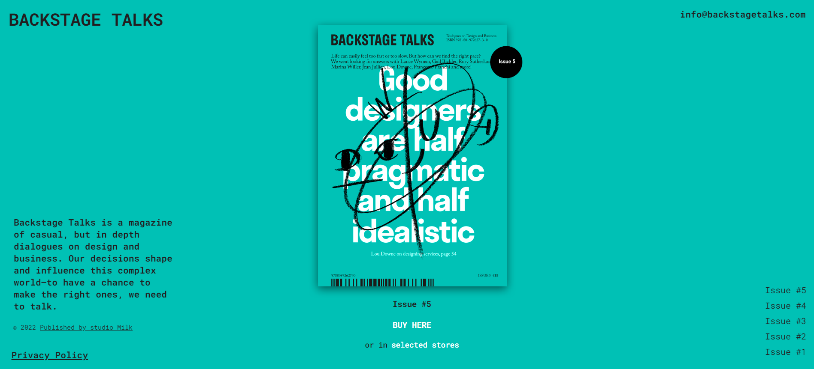
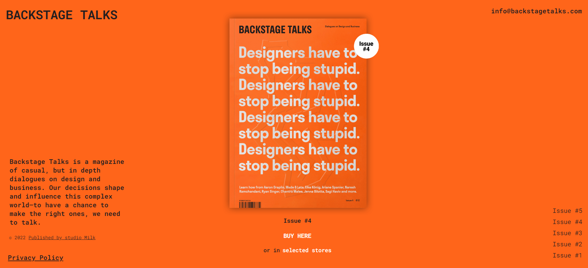
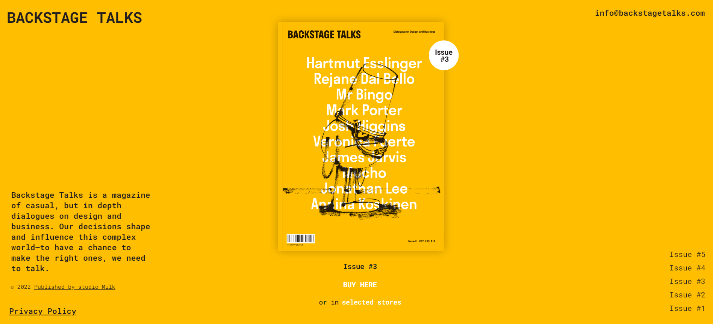
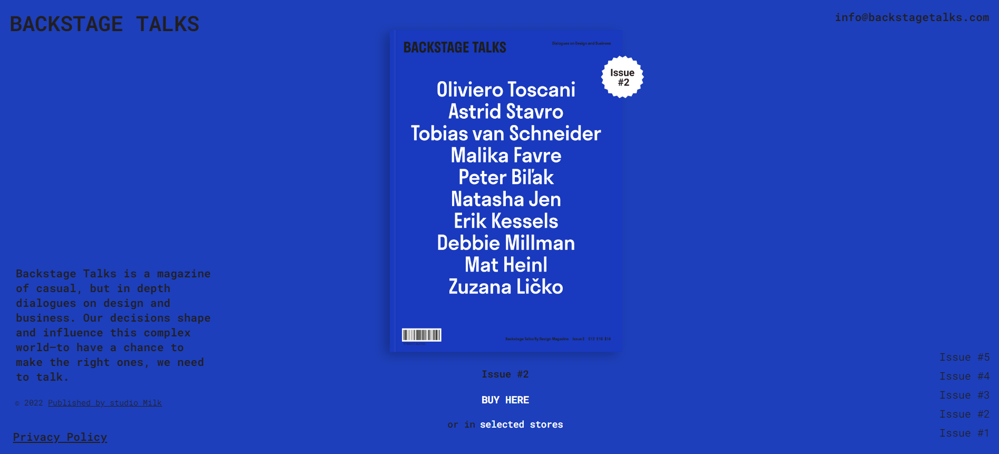
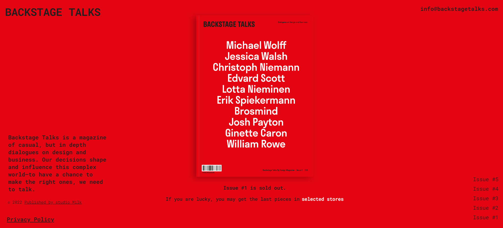

# Preview

## Frontend Practice - Backstage Talks

This is a solution to the [Backstage Talks](https://www.frontendpractice.com/projects/backstage-talks). Frontend Practice challenges help you improve your coding skills by building realistic projects.

### Table of contents

- [Overview](#overview)
  - [The challenge](#the-challenge)
  - [Links](#links)

### Overview

#### The challenge

Users should be able to:

- See hover states for all interactive elements on the page
- Use all buttons

#### Links

- Live Site URL: [Original site](https://backstagetalks.com/)
